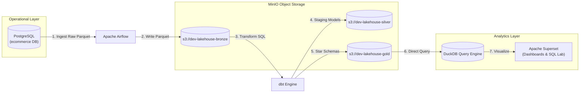
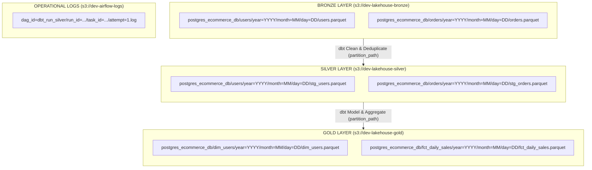
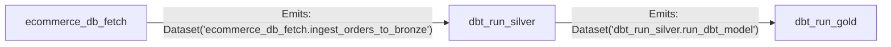

# Architecture & Technical Design

This document details the architecture, design choices, infrastructure components, and storage layout of the local Open Data Lakehouse platform.

---

## System Overview

The platform implements an ELT (Extract, Load, Transform) pattern to ingest transactional operational data, store it in open file formats on S3-compatible object storage, transform it into dimensional models, and serve it to analytics and visualization tools.

---

## Tech Stack & Components

- Source DB (OLTP): PostgreSQL 16-alpine (Operational database named `ecommerce` holding raw transactional tables)
- Orchestration: Apache Airflow 2.10.0 (Schedules and orchestrates data ingestion pipelines and dbt transformations)
- Data Lake Storage: MinIO RELEASE.2024-06-13 (S3-compatible local object storage hosting multi-bucket Medallion architecture and operational logs)
- Transformation: dbt 1.8+ (Handles data modeling, staging, deduplication, star schema creation, and data quality testing)
- Query Engine: DuckDB Latest (Embedded, high-performance OLAP SQL engine querying compressed Parquet files directly from MinIO)
- BI & Analytics: Apache Superset 6.0.0 (Visualization layer and ad-hoc SQL editor querying clean data models via DuckDB)

---

## End-to-End Data Lifecycle

1. Extraction (Airflow): Dynamic Airflow DAGs read DAG-specific `config.yaml` files, extract tables incrementally from PostgreSQL, and format date partitions.
2. Storage (MinIO - Bronze Layer): Extracted records are serialized into snappy-compressed Parquet files and uploaded to `s3://dev-lakehouse-bronze/` using domain-driven Hive paths.
3. Execution Logging (MinIO - Operational): Airflow streams task execution logs directly to `s3://dev-airflow-logs/` via the AWS S3 Provider, keeping containers stateless.
4. Transformation (dbt + DuckDB): Airflow triggers dbt runs. The dbt-duckdb engine queries raw Parquet files from Bronze, applies transformations, and materializes output tables into `dev-lakehouse-silver` and `dev-lakehouse-gold` buckets.
5. Consumption (Superset): Apache Superset connects to DuckDB as its query engine, providing interactive dashboards and SQL lab capabilities without exposing underlying S3 credentials.

---

## Storage Topology & Architectural Design Decisions

### 1. Dedicated Multi-Bucket Medallion Layout
Rather than storing all data in a single monolithic bucket with subfolders, storage is split across dedicated buckets. This enforces strict environment boundaries, simplifies IAM/access policies, and enables dedicated lifecycle management.

- `dev-lakehouse-bronze`: Immutable raw data landing layer.
- `dev-lakehouse-silver`: Cleaned, typed, and deduplicated staging data.
- `dev-lakehouse-gold`: Business-ready Star Schemas (Fact and Dimension tables).
- `dev-airflow-logs`: Isolated operational logs for Airflow task execution.

### 2. Domain-Driven S3 Pathing (Decoupled from Orchestration)
S3 key structures follow a domain-driven naming convention. Paths explicitly reference the data domain and source system rather than the orchestrator tool (e.g., avoiding `airflow/dags/` prefixes). This ensures that migrating or upgrading orchestration engines does not require costly data path relocations.

S3 Path Pattern:
s3://[bucket-name]/[source_system_domain]/[table_name]/[partition_path]/[table_name].parquet

Example (Bronze Layer):
s3://dev-lakehouse-bronze/postgres_ecommerce_db/users/year=2026/month=08/day=01/users.parquet

### 3. Hive-Style Key-Value Partitioning
Partition folders follow standard Hive key-value formatting (`year=YYYY/month=MM/day=DD`). This key-value structure allows analytical engines (DuckDB, Spark, Trino, Athena) to perform automatic partition pruning when executing SQL queries over S3.

### 4. Processing-Time Partitioning & Execution Variable Injection

To maintain strict idempotency and historical snapshot tracking, storage locations across all three Medallion layers (Bronze, Silver, and Gold) follow a consistent execution-date partition structure:

`s3://[bucket-name]/[domain]/[table_name]/year=YYYY/month=MM/day=DD/[table_name].parquet`

#### Processing Time vs. Event/Business Time
- Processing / Partition Path (Directory Structure): Represents when the Airflow pipeline executed (`logical_dat`e / `data_interval_end`). Partitioning S3 directories by execution date prevents daily DAG runs from overwriting historical snapshots, isolates incremental backfills, and guarantees pipeline re-runs are completely idempotent.
- Event / Business Time (created_at, order_date, signup_date): Preserved strictly as internal data columns inside the Parquet payload. SQL transformations aggregate and model business logic using these explicit timestamp/date fields.

#### Orchestration Variable Flow (Airflow ---> dbt ---> DuckDB)

Because Airflow tasks execute in isolated BashOperator containers across process boundaries, dbt-duckdb cannot rely on in-memory table catalog state between Silver and Gold runs. Instead, Airflow formats and passes the execution partition path dynamically into dbt as a CLI variable.

1. Airflow Orchestration
   - Task Execution: The BashOperator evaluates the Jinja template `{{ data_interval_end.strftime("year=%Y/month=%m/day=%d") }}`.
   - Payload Injection: Injects the dynamic partition path flag into the dbt CLI command:
     `--vars '{"partition_path": "year=2026/month=08/day=05"}'`

2. Silver Transformation (stg_orders.sql)
   - Input: Reads Bronze raw landing location for current execution date.
   - Output Target: Models dynamically resolve their S3 output path in their config block:
    ```sql
    {{ config(
        materialized='external',
        format='parquet',
        location='s3://dev-lakehouse-silver/postgres_ecommerce_db/orders/' ~ var('partition_path') ~ '/stg_orders.parquet'
    ) }}
    ```

3. Gold Transformation (dim_users.sql)
   - Input: Reads Silver current execution partition resolved via dbt source definition (`_sources.yml`):
    ```yaml
    config:
        external_location: "s3://dev-lakehouse-silver/postgres_ecommerce_db/orders/{{ var('partition_path') }}/stg_orders.parquet"
    ```
   - Output Target: Materializes final aggregated star-schema dataset to current execution partition:
     `s3://dev-lakehouse-gold/postgres_ecommerce_db/dim_users/year=2026/month=08/day=05/dim_users.parquet`

---

## Medallion Lakehouse Structure



---

## Orchestration & Framework Architecture (utils/dag_factory.py)

The platform leverages a centralized DAG Factory pattern powered by Pydantic v2 and Airflow Datasets. DAG definitions are completely decoupled from python boilerplate code and driven by clean, declarative YAML configurations.

### Directory Layout

```bash
dags/
├── utils/
│   ├── __init__.py
│   └── dag_factory.py        # Centralized factory logic & Pydantic models
├── dbt_run/
│   ├── src/
│   │   ├── dag/
│   │   │   ├── config.yaml   # Global base DAG configuration
│   │   │   └── models.py     # Pydantic domain models
│   ├── configs/
│   │   ├── silver.yaml       # Asset-specific configuration
│   │   └── gold.yaml         # Asset-specific configuration
│   └── _dag_dbt_run.py       # Dynamic entry point
```

### Factory Mechanisms

#### 1. Single DAG Generation (create_dag())
Used for single-purpose DAGs (e.g., operational database fetch). Loads a single YAML configuration file located at `DAG_PATH/src/dag/config.yaml`, validates settings via `AirflowConfigModel`, and returns:
- `dag`: An initialized airflow.DAG object.
- `dag_config`: A validated domain configuration (parsed into a Pydantic model or raw dict).
- `airflow_config`: The resolved Airflow metadata.

#### 2. Dynamic Multi-DAG Generation (create_dynamic_dags())
Used for generating decoupled pipeline layers dynamically (e.g., separate Silver and Gold transformation DAGs).
- Hierarchical Config Merging: Reads shared settings from `DAG_PATH/src/dag/config.yaml` and deep-merges them with asset-specific configs in `DAG_PATH/configs/*.yaml`. Asset configs override global parameters.
- Automatic Asset Discovery: Scans `configs/*.yaml` and creates one DAG per configuration file.
- Returns: A list of tuples containing (`dag`, `asset_name`, `dag_config`,` airflow_config`).

### Event-Driven Scheduling with Airflow Datasets

Pipelines communicate across layers using event-driven Airflow Datasets instead of rigid cron execution times or external trigger sensors:



1. Inbound Schedule: When a YAML config specifies `dependencies: [{dag_id: "...", task_id: "..."}]`, dag_factory converts them directly into `schedule=[Dataset(...)]`.
2. Outbound Trigger: Tasks emit explicit `outlets=[Dataset(f"{dag.dag_id}.{task_id}")]` upon successful execution, notifying Airflow to immediately trigger downstream DAGs listening for that dataset.

---

## Integration Note: Connecting with External Services (e.g., Go E-Commerce API)

While this project includes a dedicated PostgreSQL container (`postgres_source`) for standalone execution, it is designed to seamlessly integrate with external local microservices, such as an E-Commerce API written in Go.

### How to Connect via Shared Docker Network

Instead of reading from static seed databases, configure Airflow to ingest live transactional data generated by an external Go API database by attaching services to a shared Docker bridge network.

1. Define the Shared Network in `.docker/docker-compose.yaml`:
```yaml
networks:
  default:
    name: ecommerce_shared_network
    external: true
```

2. Update Airflow Database Connection:
Set `POSTGRES_HOST` and `POSTGRES_DB` to target the external API database container (e.g., `go_api_postgres:5432` / `ecommerce`).